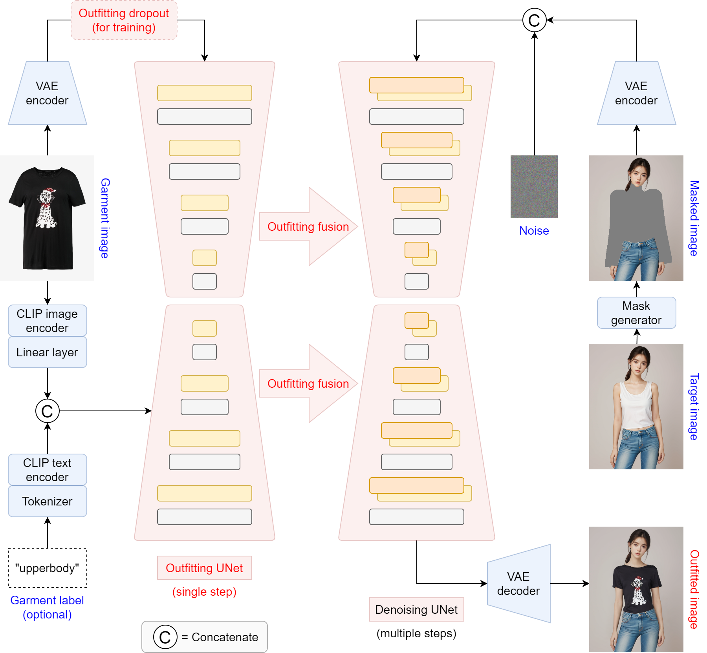

# OOTDiffusion
This repository is the implement version of OOTDiffusion

> **OOTDiffusion: Outfitting Fusion based Latent Diffusion for Controllable Virtual Try-on**<br>
> [Yuhao Xu](https://scholar.google.com/citations?user=FF7JVLsAAAAJ&hl=zh-CN), [Tao Gu](https://github.com/T-Gu), [Weifeng Chen](https://github.com/ShineChen1024), and [Chengcai Chen](https://www.researchgate.net/profile/Chengcai-Chen)<br>
> Xiao-i Research

The original paper we implemented here: [[arXiv](https://arxiv.org/abs/2403.01779)]

You can run the model here: [[Colab](https://colab.research.google.com/drive/1jUWgZYoShcfQQOwe1ZQswnz5AmOnf667?usp=sharing)]

🥳🥳 The model checkpoints trained on [VITON-HD](https://github.com/shadow2496/VITON-HD) (half-body) and [Dress Code](https://github.com/aimagelab/dress-code) (full-body) have been released!

* We use checkpoints of [humanparsing](https://github.com/GoGoDuck912/Self-Correction-Human-Parsing) and [openpose](https://huggingface.co/lllyasviel/ControlNet/tree/main/annotator/ckpts) in preprocess. Please refer to their guidance if you encounter relevant environmental issues
* Please download [clip-vit-large-patch14](https://huggingface.co/openai/clip-vit-large-patch14) into ***checkpoints*** folder

&nbsp;
&nbsp;

## Installation
1. Clone the repository

```sh
git clone https://github.com/ChrisPham-0502/OOTDiffusion-for-Virtual-Try-on.git
```

2. Create a conda environment and install the required packages

```sh
conda create -n ootd python==3.10
conda activate ootd
pip install torch==2.0.1 torchvision==0.15.2 torchaudio==2.0.2 numpy==1.24.4 scipy==1.10.1 scikit-image==0.21.0 opencv-python==4.7.0.72 pillow==9.4.0 diffusers==0.24.0 transformers==4.36.2 accelerate==0.26.1 matplotlib==3.7.4 tqdm==4.64.1 gradio==4.16.0 config==0.5.1 einops==0.7.0 ninja==1.10.2
```

## Inference
1. Half-body model

```sh
cd OOTDiffusion/run
python run_ootd.py --model_path <model-image-path> --cloth_path <cloth-image-path> --scale 2.0 --sample 4
```

2. Full-body model 

> Garment category must be paired: 0 = upperbody; 1 = lowerbody; 2 = dress

```sh
cd OOTDiffusion/run
python run_ootd.py --model_path <model-image-path> --cloth_path <cloth-image-path> --model_type dc --category 2 --scale 2.0 --sample 4
```

## Citation
```
@misc{xu2024ootdiffusion,
      title={OOTDiffusion: Outfitting Fusion based Latent Diffusion for Controllable Virtual Try-on}, 
      author={Yuhao Xu and Tao Gu and Weifeng Chen and Chengcai Chen},
      year={2024},
      eprint={2403.01779},
      archivePrefix={arXiv},
      primaryClass={cs.CV}
}
```

